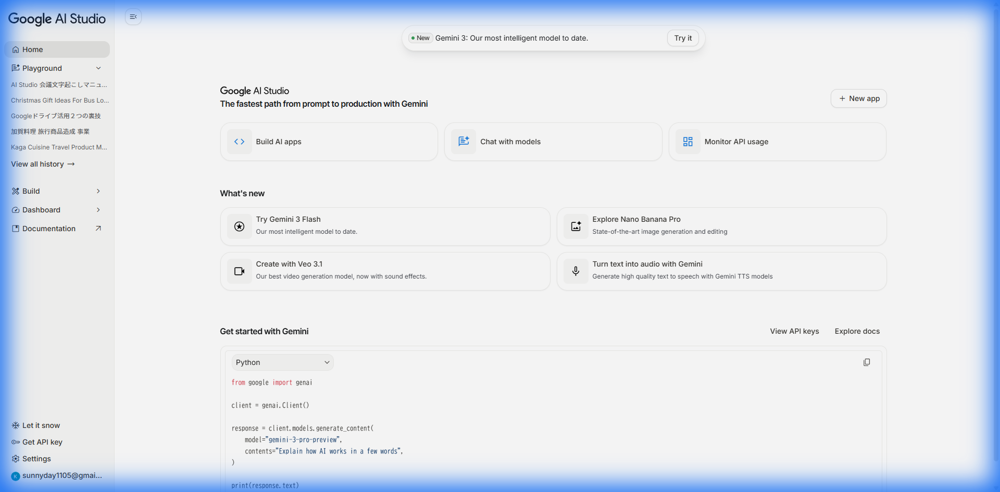
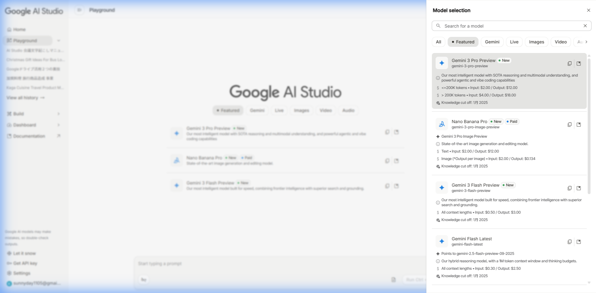
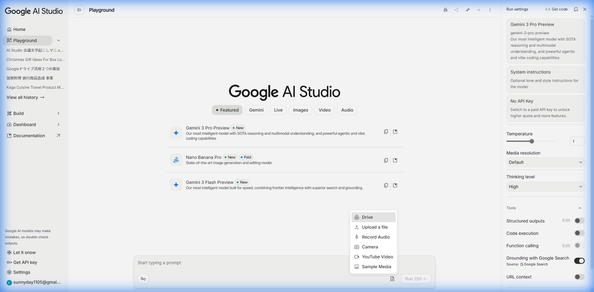

# Google AI Studio を使った会議音声の文字起こしマニュアル

## このマニュアルでできること

会議の録音データ（スマホで録音したもの等）を Google の AI を使って自動で文字に起こし、**誰が何を話したか** がわかる議事録の原稿を作成できます。

---

## 準備するもの

| 必須 | あると精度アップ |
|------|------------------|
| ✅ Googleアカウント | 📋 参加者名簿（テキストでOK） |
| ✅ 会議の録音データ（mp3, m4a, wav など） | 📄 会議資料（PDF, Word など） |

> [!TIP]
> **精度アップのコツ**: 参加者名簿や会議資料を一緒にアップロードすると、AIが名前や専門用語を正しく認識してくれます！

---

## 作業手順

### ステップ 1: Google AI Studio を開く

ブラウザで以下のURLにアクセスします：

**https://aistudio.google.com/**

初めての方は、お持ちのGoogleアカウントでログインしてください。

---

### ステップ 2: 新しいチャットを始める

トップページが表示されたら、**「Chat with models」** をクリックします。



---

### ステップ 3: 最新のAIモデルを選ぶ

右側のパネルにあるモデル選択ボタンをクリックし、**「Gemini 3 Pro Preview」** を選びます。
これが現時点で最も高性能なモデルです。



---

### ステップ 4: 録音データと資料をアップロードする

1. 画面下部の「**＋**」ボタン（または「Insert...」ボタン）をクリックします
2. メニューから **「Upload a file」** を選択して、録音ファイル（mp3, m4a, wavなど）をアップロードします
3. **（重要）** 同じ手順で参加者名簿や会議資料（PDF, Wordなど）もアップロードしましょう



> [!IMPORTANT]
> **名簿・資料を添付すると精度が上がる理由**
> - AIが参加者の名前を正確に認識できる
> - 専門用語や固有名詞を正しく聞き取れる
> - 話の文脈を理解して間違いが減る

---

### ステップ 5: AIへの指示文を入力する

以下の指示文をコピー＆ペーストして、テキスト入力欄に貼り付けてください。

---

## 📋 そのまま使える指示文テンプレート

```
この音声ファイルは会議の録音です。以下の作業をお願いします。

【やってほしいこと】
1. 音声の内容を文字に起こしてください
2. 話している人ごとに発言を分けてください
3. できるだけ正確に、話された言葉をそのまま書き起こしてください
4. 「えー」「あのー」「まあ」「その」などの言いよどみ（フィラー）は取り除いてください

【出力形式】
話者A: 〇〇〇〇〇
話者B: △△△△△
※話者名が添付の名簿から判別できる場合は、実名で記載してください

【添付資料について】
- 名簿や会議資料を添付している場合は、それを参考にして人名や専門用語を正確に記載してください
```

---

### ステップ 6: 実行して結果を確認する

1. 指示文を入力したら、**「Run」** ボタン（または送信ボタン）をクリック
2. AIが処理を開始します（音声の長さによって数分かかることがあります）
3. 結果が表示されたら、コピーして議事録作成に活用してください

---

## よくある質問

### Q: 音声ファイルのサイズ制限はありますか？
A: Google AI Studio では、かなり長い音声でも処理できます。1時間以上の会議でも対応可能です。

### Q: 話者を正しく分けてくれない場合は？
A: 以下を試してみてください：
- 参加者名簿を必ず添付する
- 指示文に「参加者は○○さん、△△さん、□□さんの3名です」と明記する

### Q: 専門用語が間違って変換される場合は？
A: 会議資料やアジェンダを添付すると改善します。また、指示文に「○○という専門用語が使われます」と補足するのも効果的です。

---

## 困ったときは

- **ログインできない** → 会社のGoogleアカウント（G Suite）でログインしてみてください
- **ファイルがアップロードできない** → ファイル形式を確認してください（mp3, m4a, wav に対応）
- **結果が正しくない** → 指示文を具体的にするか、参考資料を追加してください

---

**作成日**: 2025年12月18日
